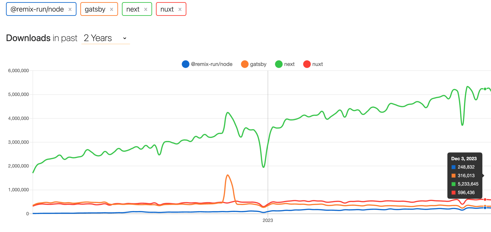
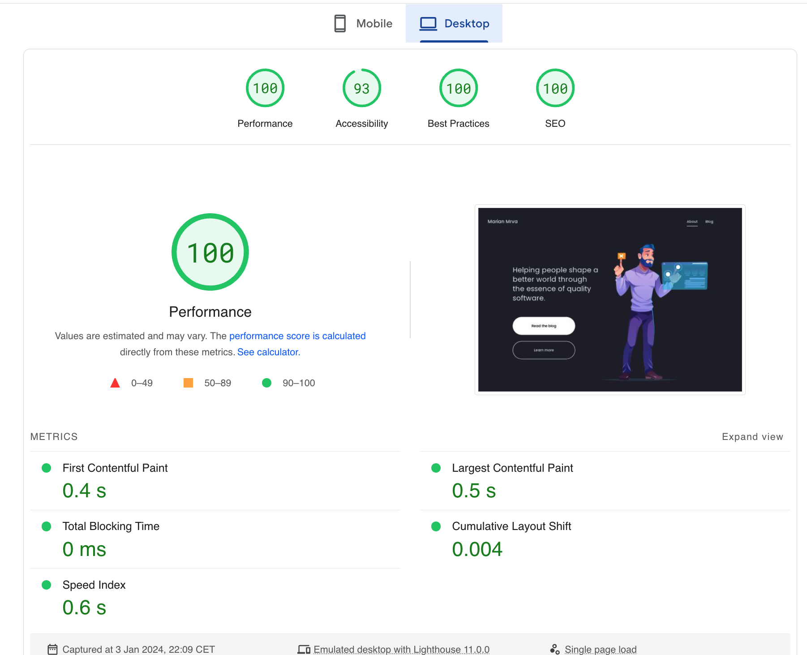

## React tooling

If we take a look more closely on 2023 year, React tooling did a great progress.

Project [create-react-app](https://github.com/facebook/create-react-app) was created almost 8 years ago by [Dan Abramov](https://twitter.com/dan_abramov) which was the fastest way in the past how to start React project without messing with setting up Webpack and Babel by our own.

Nevertheless `create-react-app` starts to be more and more deprecated, I'm gonna list some problems:

- CRA Github Issues: 1.7k
- [React official docs](https://react.dev/learn/start-a-new-react-project) are NOT recommending CRA anymore, started with [Theo's thread](https://github.com/reactjs/react.dev/pull/5487)
- Luck of config support for libs like [Tailwind CSS](https://tailwindcss.com/docs/guides/create-react-app)
- Performance issues
- Critical Security Vulnerabilities
- Downtrend/stagnation of the package installations

It might be thought like a bad thing, but actually it creates a space for different projects to shine such as latest trend [vite](https://vitejs.dev/).

### vite

[Vite](https://vitejs.dev/) is a build tool and development server for modern web applications. It is designed to be fast and efficient, leveraging native ES Module imports for quicker development iterations. Vite supports various front-end frameworks, making it a versatile choice for building performant and scalable web applications.

It's not tight to the specific UI library such as `react`, `vue`, `preact` or just `vanilla JS` so the migration should be faster. Some frameworks toolings are even based on vite at example `Astro` or `Qwik` (Misko Hevery)

For me `Vite` seems one of the best options, how to start new SPA app project in the 2023 or migrate existing SPA from `Create React App` ([here is a great migration guide](https://cathalmacdonnacha.com/migrating-from-create-react-app-cra-to-vite#))

## SSR Frameworks

### Next.js

Next.js is a popular open-source React-based web framework that simplifies the process of building server-rendered React applications. Developed by Vercel, Next.js provides a set of conventions and tools for developing React applications with features like server-side rendering (SSR), automatic code splitting, and an easy-to-use routing system.

Personally I had chance to create client's project from scratch in the `NextJS` in 2023 and I could say, currently it's the most adopted `SSR framework` even though it has still many caveats, I hope it will improve in the future.

I'm really impressed how `NextJS` is helping us to solve by default many CSR (Client Side Rendering) issues like performance (bundle sizes, loading images etc.), but keeps still quite good DX we are used to, from CSR world - looking forward to adopt it also for existing CSR React projects I'm working with.

I feel strong community pushing forward this project, unfortunately/luckily it's connected to commercial business (Vercel) - that was the case also with React and here we are 10 years later. :)

Also I have to mention it's direct competitors [Remix](https://remix.run/) (React) and [Nuxt](https://nuxt.com/) (Vue).

`Remix` done excellent journey, going a bit different direction than Next.js, but still there is chance for a bright future with great people around like `Ryan Florence` or educator `Kent C. Dodds` (& his new course [epicweb](https://www.epicweb.dev/) completely written with Remix).

Let's finish it with self explaining chart.

### Astro

Astro is the last framework I would like to mention as a separate category since it's still considered like SSR framework, but it's highly focused on let's say "more static content", which was one of the reasons why I chose it also for the blog `marianmrva.com`.

It uses `"Astro Islands"` frontend architecture, more commonly named `partial` or `selective hydration` - rendering and hydrating only the necessary components on the client side, optimizing performance by reducing the amount of JavaScript needed for initial page loads.

The `.astro` UI language is a superset of `HTML`: any valid HTML is valid Astro templating syntax! So, if you can write HTML, you can write `Astro components`! Of course you can combine it with your favourite UI component library - `React`, `Preact`, `Svelte`, `Vue`, `Solid` or `Lit`.

If you need to serve mostly static content as fast as possible, with GREAT SEO, place it on the CDN as close to your user as possible, `Astro` might be a great choice.

 

## Libraries that makes my life easier

### react-query

React query or [TanStack Query](https://tanstack.com/query/v3) how it was renamed this year, is the tool that makes my life incredibely easier day by day.

React Query is a library for managing and `caching asynchronous data fetching` in NOT only React applications (React, Solid, Vue, Svelte), providing a declarative and efficient way to handle `state management for remote data`.

If you ever tried to implement caching it's not only hard but it's a mess. More features you are implementing
like paginations, infinite queries, parallel/dependent queries etc., makes things more tricky.
That's why React Query was invented and it's doing really great job to solve these issues.

This library also makes change in the mindset of developers, when we want to always think `which data belongs to server`, which are updated frequently (we want to serve them as fresh as possible) and which belongs to client (application run-time).

I promise that it not only drastically improves the UX (because of proper caching/re-validation techniques), but also removes a lot of unecessarry client side code (reducers, actions etc..) 😍.

### msw

Finally the tool that helped me to improve working with mocks, thanks to my team-mate Mateusz for bringing it up 🙌!

MSW, or Mock Service Worker, is a library that allows developers to mock HTTP requests in the browser during development, enabling the testing and development of frontend applications with realistic API interactions without the need for a real backend.

I have [entire blog dedicated to it](../blog/mocking-msw-service-worker), feel free to check it out!

### zod

I have learned during my career about layers, how I can make sure the code I write is doing what I'm expecting from it, namely:

1. Statis Analysis - TypeScript
2. Unit Tests - Jest
3. Integration Tests - React Testing Library
4. E2E tests - Cypress

Now it's a time to add another layer to make sure our users are happy with 99.9% app uptime.

Layer that validates in `run-time the data coming from the API, are really the one we are expecting`.

Don't trust your backend, rather validate through Zod schemas! (Better safe, than sorry). 🍻

Zod is a TypeScript-first schema declaration and validation library that allows developers to define and validate data schemas in `run-time!` and then convert them to TypeScript (declare once then create static types from it easily).

My 2024 resolution is to include `Zod` to more projects as pros of using it are inevitable for any FE app communicating with APIs.

## Conclusion

As we reflect on the state of frontend development in 2023, it's evident that the landscape has evolved significantly, with advancements in React tooling, the emergence of powerful frameworks like `Next.js`, `Remix`, and `Astro`, tooling like `Vite` and the integration of useful libraries such as React Query, MSW, and Zod.

The deprecation of projects like `create-react-app` has paved the way for innovative solutions like Vite, offering speed and efficiency in modern web application development.

I'm super excited about transition that is hard to stop from CSR to SSR, especially the fact we can decide with the FE frameworks per page which are rendered on the server (SSR), on the client (CSR) and in build time (SSG). Let's see how quickly it escalates.

`Next.js`, despite its caveats, remains a widely adopted SSR framework, addressing common challenges in client-side rendering and demonstrating a strong community backing.

I'm super excited about what 2024 will bring to our frontend development community and to our lives.

`I wish you all the best to 2024!!`

🚀 🌐 🎉

