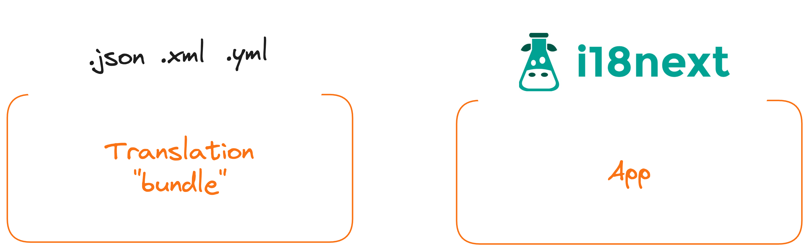
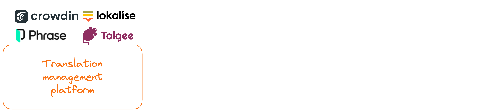
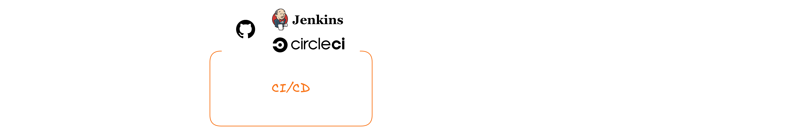
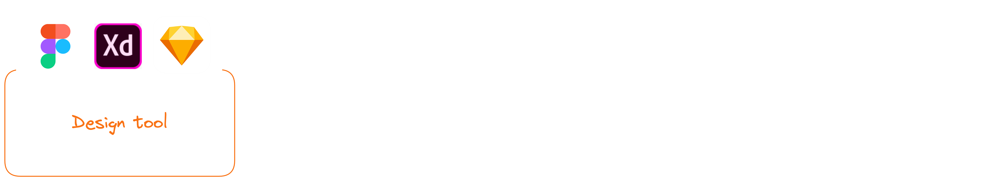
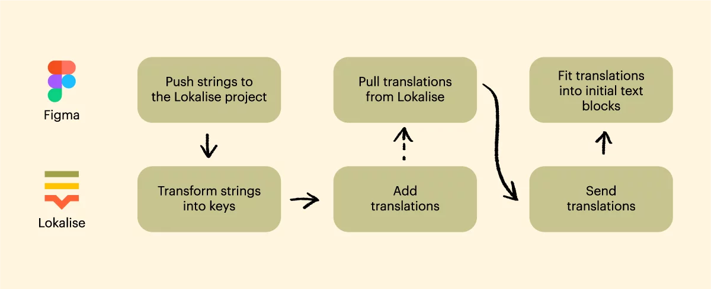
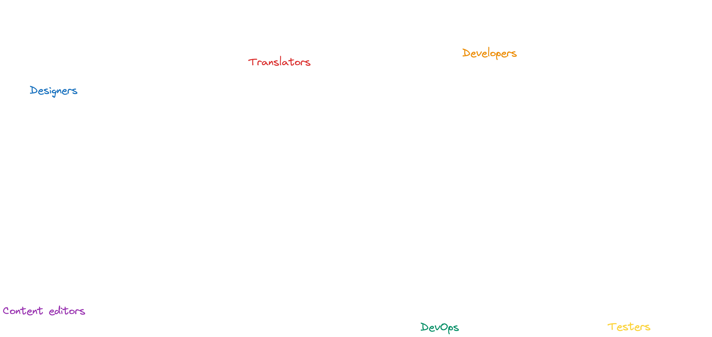

## Strategies for multilingual app success

If you've ever wrestled with the challenges of adapting your application to meet the needs of users from diverse countries, you will probably sooner or later need to define a way how translate text of your app to the certain languages and then provide it to your users.
In this blog post, we'll dive deep into the art of localization, exploring diverse strategies for crafting a seamless multilingual experience.

From a beginner-friendly "Dummy Setup" using JSON translation bundles to advanced configurations integrating Translation Management Platforms (TMP), CI/CD pipelines, and even design tools, we'll navigate the spectrum of possibilities.

### Dummy setup

<br/>



<br/>

The first thing we need is a file that has structured format (like JSON).
Let's break down the structure of this example file.

```json
{
  "en": {
    "welcome": "Welcome to our App!",
    "greeting": "Hello, {name}!",
    "messages": {
      "success": "Success! Operation completed.",
      "error": "Oops! Something went wrong."
    }
  },
  "es": {
    "welcome": "¡Bienvenido a nuestra aplicación!",
    "greeting": "Hola, {name}!",
    "messages": {
      "success": "¡Éxito! Operación completada.",
      "error": "¡Oops! Algo salió mal."
    }
  }
}
```

- `Language code:` First level of the object defines language by `language code` at example `"en"` or `"es"`.
  That's a string, that will be later connected with a users language got from browser.
- `Translation strings:` Under each language code, there are key-value pairs representing different strings in the application that need to be translated.
- `Nested trees:`
  The structure is hierarchical, with nested objects for more organized categorization. In this case, the "messages" object contains success and error messages.
- `Placeholders:`
  Dynamic content is accommodated through placeholders. For example, the "{name}" placeholder in the "greeting" string can be replaced dynamically with the user's name.

Now we can add our brand new file `translations.json` to the project.

```
my-react-app/
├── public/
│   ├── index.html
│   ├── translations.json
├── src/
│   ├── components/
│   │   ├── Greeting.js
│   ├── App.js
│   ├── index.js
```

Once we have ready our translation file, lets fetch it to the application.

```javascript
// App.js
const App = () => {
  const [translations, setTranslations] = useState(null);

  useEffect(() => {
    // Fetch translations dynamically
    fetch("/translations.json")
      .then(response => response.json())
      .then(data => setTranslations(data))
      .catch(error => console.error("Error fetching translations:", error));
  }, []);

  return (
    <div className="App">
      <header className="App-header"></header>
    </div>
  );
};

export default App;
```

The useEffect block is part of the React component lifecycle, and in this case, it is used to fetch translations from a translations.json file when the component is first mounted. The fetch function makes an HTTP request to the specified file, parses the response as JSON, and updates the component's state with the fetched translations using the setTranslations function.

Let's add two new parts:

- Initialize i18n with resources `i18n.init()`
- `<select>` tag that triggers change of the language based on user choice through `i18n.changeLanguage(selectedLanguage);`

```javascript
import React, { useState, useEffect } from "react";
import { useTranslation } from "react-i18next";

const App = () => {
  const { t, i18n } = useTranslation();
  const [translations, setTranslations] = useState(null);

  useEffect(() => {
    fetch("/translations.json")
      .then(response => response.json())
      .then(data => setTranslations(data))
      .catch(error => console.error("Error fetching translations:", error));
  }, []);

  useEffect(() => {
    if (translations) {
      // Initialize i18n with translations
      i18n.init({
        lng: "en",
        resources: translations,
      });
    }
  }, [translations, i18n]);

  const changeLanguage = selectedLanguage => {
    i18n.changeLanguage(selectedLanguage);
  };

  return (
    <div className="App">
      <header className="App-header">
        <h1>{t("welcome")}</h1>
        <p>{t("greeting", { name: "John" })}</p>
        <p>{t("messages.success")}</p>
        <p>{t("messages.error")}</p>

        {/* Select box for changing language */}
        <select onChange={e => changeLanguage(e.target.value)}>
          <option value="en">English</option>
          <option value="es">Español</option>
          {/* Add more languages as needed */}
        </select>
      </header>
    </div>
  );
};

export default App;
```

Vualaa our "dummy setup" is done and our users could switch between translations! ✅ 🎉 😍

## Translator friendly setup

This setup is nice and easy but what if we want to bring `translators` to the flow? You bet `nobody except developers don't want to touch JSONs` directly. What if we want to have better UX during creation/updates of the translations strings, versioning, having more scalable flow?

Time to bring `Translation Management Platform` (TMP) to the flow!

<br/>



<br/>

There is bunch of competitors in the market you could choose. Either pick the `commercial service` running in the cloud and subscription model or open source solution that will be hosted on your dedicated server.
Both options has it's own pros and cons, choose wisely. :)

<br/>

`Commercial solutions`

- `Lokalise:` [Lokalise](https://lokalise.com) excels with its versatile platform, offering real-time collaboration and seamless integration for efficient project management. Its standout feature is the ability to adapt to diverse file formats, simplifying content localization across a variety of projects and industries.

- `Crowdin:` [Crowdin's](https://crowdin.com) major strength lies in its crowd-based approach, enabling collaborative translation with a global community. This unique feature ensures a diverse and expansive pool of translators, fostering a dynamic and comprehensive localization process unmatched by some competitors.
  Phrase:

- `Phrase:` [Phrase](https://phrase.com/) distinguishes itself with a user-friendly interface and seamless integration with development tools. Its standout feature is the emphasis on simplicity, making it an ideal choice for teams seeking an intuitive platform that enhances the localization process without unnecessary complexities.

`Open-source alternatives`

- `Tolgee:` [Tolgee](https://tolgee.io) is the new innovative localization product runned by Czech startup. It revolutionize market with the features like "Translation of the strings directly in the app you develop. Even in production." Free cloud plan + Apache License 2.0 license makes it perfect choice for any company scale.

- `Weblate:` [Weblate](https://weblate.org) has gained popularity for its user-friendly interface and continuous translation support. It is actively maintained, has a strong community, and is widely used in various open-source projects.
  Includes GPL license.

<br/>

`What would look like a flow to add TMP to the existing/new flow?`

- Create a `new translation project` in the TMP of your choice
- `Define languages` you want to translate to
- Add a `new translation keys` to the TMP or `upload the existing JSONs`
- Translate bunch of keys (to at least 2 languages), so we know the localisation works correctly
- Use a `"Download"` feature with defined configuration (Indentation, Choose languages to export, Empty translations etc.)
- You got your Translation bundle `JSON file ready to replace inside your project`!

## Automation setup

Okay, now we came to the point we improved a way how our application is translated more efficiently.

The issue you can identify during working with this flow is the `annoying manual replacement` of the translation file(s) after every "download" (change of the translations/keys).

Luckily there are bunch of ways how we could automate this process.

<br/>



### CI/CD + GIT repo

- Create a new GIT repository `my-app-translations`
- Change TMP `"Download" configuration to trigger update of translations in our repository` (most of the TMPs has integration with Gitlab, Github and Bitbucket).
  Whenever we hit `"Download" button`, our repository will be updated with a new version.
- One of the benefits of having separate git repo is to have full version control of translations on our side
- Then we can setup a new pipeline in `Github Actions`, `Jenkins`, `CircleCI` or whatever CI/CD provider we choose that will handle steps we define
- To solve our issue with manual updating of the files we can automatically trigger deployment of the new `translations.json` from git repository `my-app-translations`. Whenever push to the certain branch happens, the `translations` file will be updated on the domain of our staging environment - at example `https://myapp.com/translations.json`.

<br/>

> `Perfect, now we can only hit "Download" button in the TMP and all new translations are deployed to our environment automatically!` ✅ 🎉

## E2E setup

By actively involving `designers` in `defining Lokalise translations keys`, teams can streamline the localization process, reduce potential misalignments between design and translation, and ultimately deliver a more polished and consistent user experience across multiple languages.

<br/>



<br/>

This approach is nice when your product is getting bigger and you want to also make sure the process of creating translations starts bottom to top (`Designers -> Translators -> Developers`).

Many `TMPs` has integration with the most popular design tools like `Figma`, `Adobe XD` or `Sketch`.



It really makes life of the people in the team easier to close "E2E" circle.

For more informations please follow up at example [Lokalise integration with Figma](https://lokalise.com/blog/figma-lokalise/)

### Localization roles



### Conclusion

Embarking on the app localization journey has uncovered a spectrum of strategies, from beginner-friendly setups to advanced configurations.

The `"Dummy Setup"` using JSON translation bundles laid the foundation, but as applications grow, `Translation Management Platforms` (TMPs) like `Lokalise`, `Crowdin`, and `Phrase` emerged as key players, offering real-time collaboration and supporting diverse file formats. Open-source alternatives like `Tolgee`, `Weblate` and `Zanata` also provide robust solutions.

`Automation` through `CI/CD` pipelines and GIT repositories streamlined the translation update process, while an `end-to-end (E2E) approach ` highlighted the importance of `designers` in defining Lokalise key strings, fostering a collaborative and holistic localization process.

Ultimately, the app localization odyssey is a multifaceted endeavor, ensuring a consistent and delightful user experience across diverse languages and cultures.
