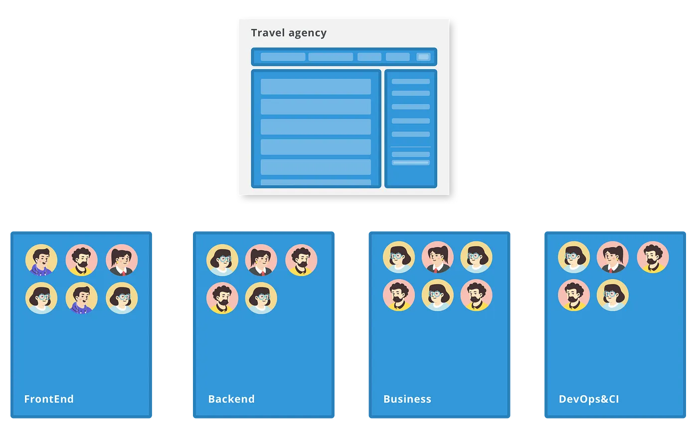
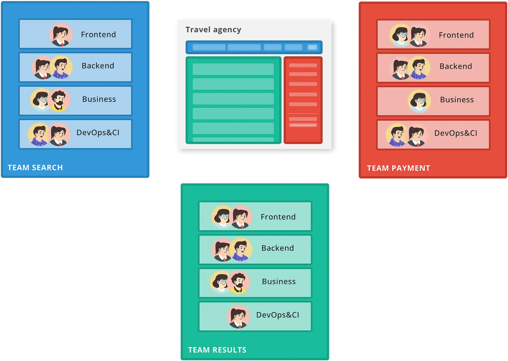
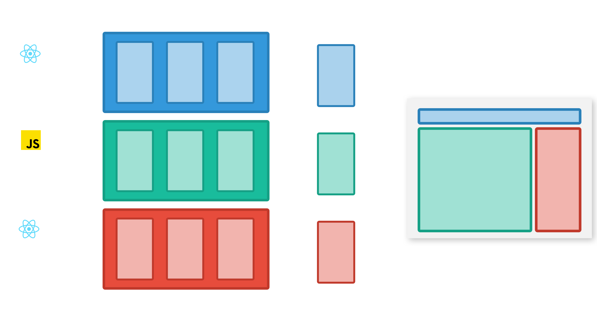
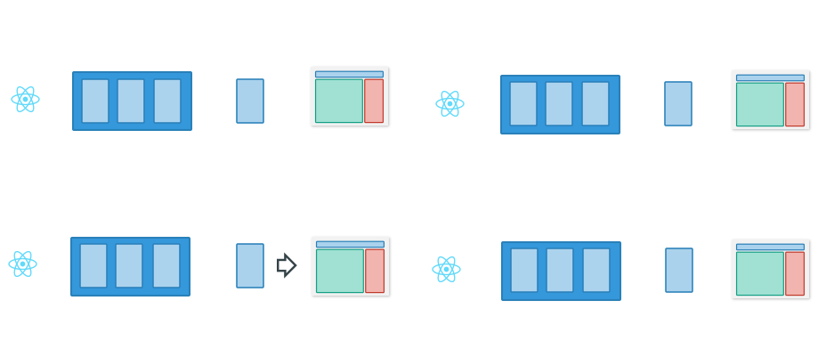

## History

The term Micro frontends was invented in 2016, when Thought Works with <strong>Martin Fowler</strong> came with the revolutionary idea. This idea was based on nothing else than the <strong>“Microservices” architecture</strong>. Microservices were invented by Mr. Peter Rodgers in 1999, as research for the company Hewlett Packard Labs.

Later in 2005, Peter presented on the conference term “Micro-web-services” — a very well designed platform of Micro services, that is using principles of the Web, REST services together with UNIX-like scheduling and pipelines which provide excellent flexibility, scalability with a service oriented approach.

Just for <strong>high scalability, possibility to develop, test and release independently, this architecture was adopted by so many great companies</strong> like Spotify, Microsoft and a number of other SW leaders in the Tech industry.

## What the hell are Micro Frontends?

> Micro Frontends is a concept, when a website or web application (monolith), is divided into multiple features — services. Each feature is working like a separated, isolated piece, it’s owned by an independent team and has its own GIT repository. Team is working on development of the End To End solution from the database till the end — UI.

The goal of the Micro Frontend is to provide the user an opportunity to <strong>do one action and do it as good as possible</strong> — bring him the value (search for a flight, pay for a ticket).

The mission of the team that owns the feature is to take care of this piece of the puzzle, specialised in the specific area where it fits — there is a difference between an average and a great product that scales well and users loves it.

## Monolith VS Micro Frontends

It’s important to understand that migration from Monolith app to Micro Frontends, does not only change our view on the architecture, but also defines good practises about the structure of the teams and their part of the ecosystem.

There are more approaches we could choose, I’m describing the sustainable one, for a larger number of the teams working on the same product.

As an example we could use a travel agency that has a product focused on the plane tickets search. (definitely not a product placement 🥝 😄 )

Using standard monolithic approach, the structure of the company usually begins with the following visualisation (Standard Monolith approach):

People are divided, based on what they are specialised into. Seems it is nothing unusual.

The agency starts to grow rapidly in terms of features in the product, but also the people that are hired into the company, a lot of new talented people coming to the product.

Three Front End developers become 13, later 30, scaling of a product starts to be a nightmare.

Product releases start to be rare events — each half year or once per year (which is not a good for an agile SW development and early customers feedback). Product management is so overwhelmed by the amount of things they need to sync together.

 

<strong>Sooner or later (from my own experience) we will run into these problems with a big Monolithic application:</strong>

- conflicts in the code are happening more and more often, that leads to unexpected bugs (in worst scenario they go even to the production)

- people spend so much time in the meetings, talking with people how to fix or avoid cross-feature problems, more than development of the app itself 🤯

- difficulty of the migration from older technology to technology standard goes exponentially high with a number of developers and lines of code in the project

- application speed often falls dramatically and finding of the problem cause and fix takes a lot of time = money

- testing of an app

- takes more time for the newcomers get used to a codebase

## Migration of the travel agency to Micro Frontends

Now we understand the pitfalls that Monolith could bring after some time. Let me show you how we could transform products in terms of <strong>people structure</strong> and set up the correct release cycle for <strong>Micro Frontends.</strong>

We could split plane tickets search into 3 pieces (services).

- <strong>Search</strong> — From/To city, departure, algorithm to search ideal route..

- <strong>Results</strong> — list of the found tickets, filtering by parameters..

- <strong>Payment</strong> — payment gateways, personal info..

 

Example of the composition of a teams working with Micro Frontends:

 

 

> “Just as with microservices, independent deployability of micro frontends is key. Regardless of how or where your frontend code is hosted, each micro frontend should have its own continuous delivery pipeline, which builds, tests and deploys it all the way to production.” — Martin Fowler

Martin emphasises that the setup of the independent, autonomous pipeline is extremely important. Let’s see what it might look like in the practice for our travel agency.

Each Micro Frontend (Search, Results, Payment), has its own pipeline that will be triggered upon introduction of the new code into the repository. The main goal of a pipeline is to build and test the app. In case everything went well, pipeline automatically deploys the app bundle with other files (like assets and CSS), into the specific environment (DEV/TEST/QA/PROD).

General diagram of the release pipeline:

 

 

For example, team “Search”, could use the following release strategy (diagram below). They could go through the whole process from DEV all the way to Production without disturbing team “Results” or team “Payment”. In case “Search” Micro Frontend changes the way how it communicates with the other MFs, there might be some small internal communication about API, but that’s on another topic 😉.

## Summary

In today’s part, we’ve shown the benefits of the Micro Frontends strategy. When is it worthwhile to start the migration from the Monolithic application, how to set up teams and the release process. Of course, Micro Frontends are not always suitable for every company / product. It is always necessary to consider whether the benefits outweigh the time required to transform Monolith into Micro Frontends. The question also arises how to set up an MF infrastructure, while there are several options and each of them has its own pros and cons for a particular product.
