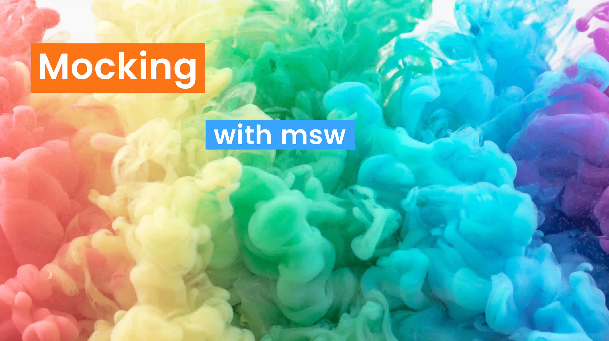
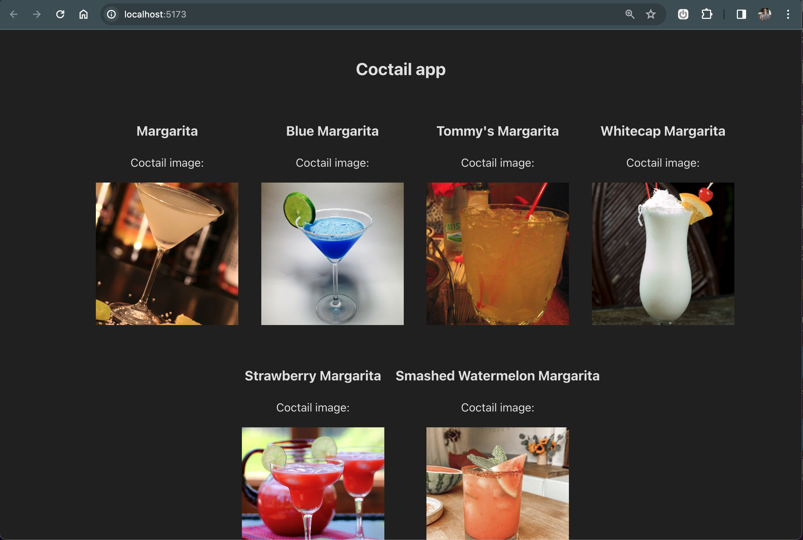
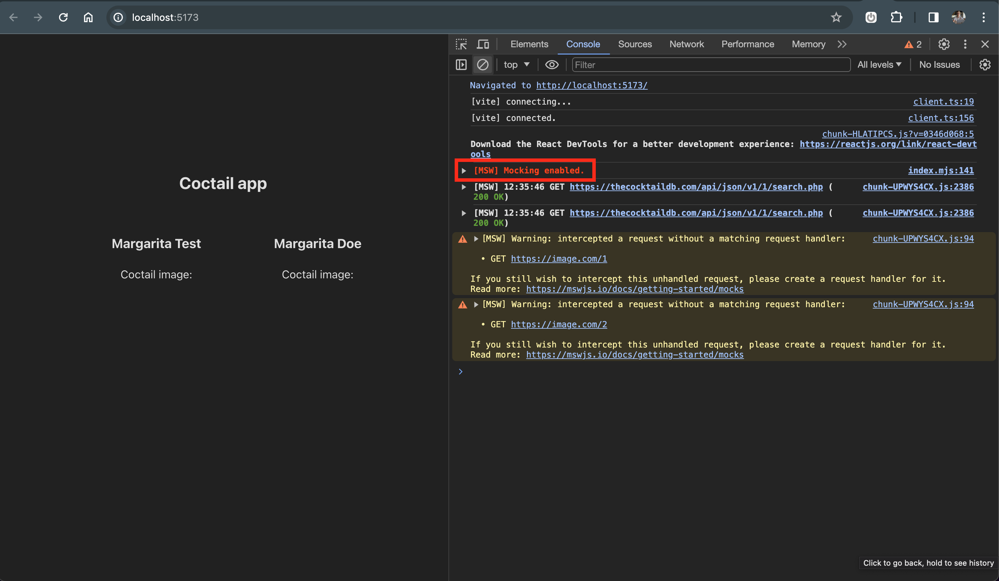
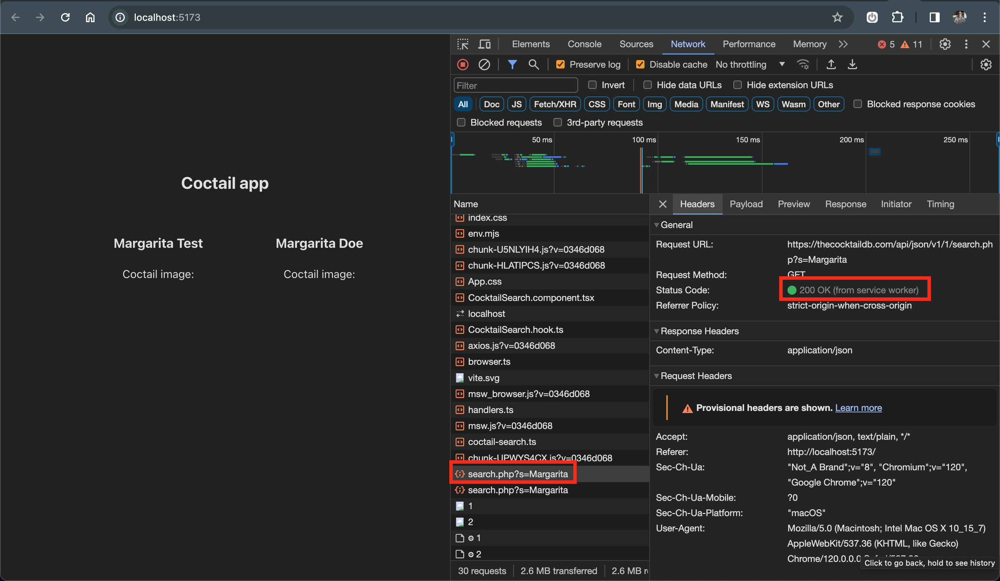
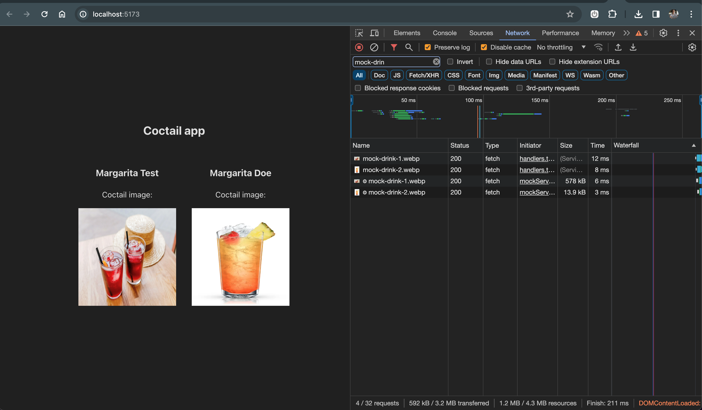

### Why service worker to mock API requests

- 💪 [MSW](https://mswjs.io/) significantly elevates reusability by serving as a consistent mock for local development, integration tests, and end-to-end testing. We don't need to maintain multiple types of the mocks for each use-case anymore! 😍
- <strong>Simulation of Server Responses</strong>: They offer a convenient means to simulate diverse server responses, allowing developers to test different scenarios such as success, loading and error scenarios.
- <strong>Isolation of Frontend Development</strong>: This approach enables developers to work on <strong>frontend features independently of the backend</strong>, fostering parallel development.

### What we will build

In this blog post, we'll take a hands-on approach to creating a simple yet dynamic <strong>cocktail list application</strong>.

Our toolkit will include the powerful combination of <strong>Vite</strong> for fast and efficient development, <strong>Jest</strong> as a standard in the JS testing, <strong>react-testing-library
</strong> for effective React component integration testing, and <strong>MSW (Mock Service Worker) to simulate a server environment without the need for an actual backend</strong>. Let's dive in and shake up some code!

Here is the [GitHub Repository](https://github.com/surfer19/template-msw-vite-jest) with the full solution.

### Setup the API call

Once the project configuration with libraries are set up based on GitHub, we can go ahead with creating API call.

```typescript
export const useFetchCocktailSearch = ({
  cocktailName,
}: UseFetchCocktailSearchProps) => {
  const [cocktailList, setCocktailList] = useState<CoctailData[]>();

  useEffect(() => {
    const fetchData = async () => {
      const coctailsResponse = await axios.get<CoctailResponse>(
        `https://thecocktaildb.com/api/json/v1/1/search.php?s=${cocktailName}`
      );

      setCocktailList(coctailsResponse.data.drinks);
    };

    fetchData();
  }, [cocktailName]);

  return {
    cocktailList,
  };
};
```

### Render response from the server

```typescript
export const CocktailSearch = ({ cocktailName }: CoctailProps) => {
  const { cocktailList } = useFetchCocktailSearch({ cocktailName });

  return (
    <>
      <ul>
        {cocktailList?.map((cocktail) => (
          <li key={cocktail.idDrink}>
            <h3>{cocktail.strDrink}</h3>
            <div>
              <div>Coctail image: </div>
              
            </div>
          </li>
        ))}
      </ul>
    </>
  );
};

```

then we can render the component:

```typescript
<CocktailSearch cocktailName="Margarita" />
```

Let's start with a custom React hook named `"useFetchCocktailSearch"`. It uses the `"useState"` and `"useEffect"` hooks from React, along with the axios library for making asynchronous HTTP requests.

The `"useFetchCocktailSearch"` hook takes a `"cocktailName"` as a prop, `fetches data from a public API based on that name`, and manages the state of the fetched cocktail data (`"cocktailList"`). The fetched data is then stored in the state variable, and the hook returns an object containing the `"cocktailList"` for use in the consuming component.

### Vualaa

Now you should see something like this:



### Define a mock

First of all let's define a mock response, which we later pass to the interceptor.

```typescript
// src/mocks/coctail-search.ts
export const mockCoctailSearchResponse = {
  drinks: [
    {
      idDrink: "1234",
      strDrink: "Margarita Test",
      strDrinkThumb: "https://image.com/1",
    },
    {
      idDrink: "4321",
      strDrink: "Margarita Doe",
      strDrinkThumb: "https://image.com/2",
    },
  ],
};
```

### Intercept HTTP request

```typescript
// src/mocks/handlers.ts
import { http, HttpResponse, PathParams } from "msw";
import { mockCoctailSearchResponse } from "./coctail-search";
import { CoctailResponse } from "../components/cocktail-search/CocktailSearch.hook";

const coctailsHandler = http.get<PathParams, CoctailResponse>(
  // match request at this path (predicate)
  "https://thecocktaildb.com/api/json/v1/1/search.php",
  // intercept request and return whatever JSON we need (resolver)
  () => {
    return HttpResponse.json(mockCoctailSearchResponse);
  }
);

export const handlers = [coctailsHandler];
```

<br/>

<strong>Handler Definition:</strong> The `"coctailsHandler"` is defined using `"http.get"`, indicating that it handles HTTP GET requests. It takes two generic types: `"PathParams"` for URL path parameters and `"CoctailResponse"` for the expected response type.

The first argument defines a predicate path to the API endpoint `"/api/json/v1/1/search.php"` we want to intercept.

<strong>Request Resolver:</strong> The second argument to `"http.get"` is a resolver function. It intercepts the request and returns a mocked response using `"HttpResponse.json"`. In this case, it returns the predefined `"mockCoctailSearchResponse"` as the JSON payload.

### Setup msw server

```typescript
// src/mocks/node.ts
import { setupServer } from "msw/node";
import { handlers } from "./handlers";

export const mswServer = setupServer(...handlers);
```

### Write an integration test

First we need to make sure that jest starts the msw mock server properly after we run the jest command:

```typescript
// setupTests.ts
import "@testing-library/jest-dom";
import { mswServer } from "./mocks/node";

beforeAll(() => mswServer.listen());
afterEach(() => mswServer.resetHandlers());
afterAll(() => mswServer.close());

// jest.config.ts
export default {
  preset: "ts-jest",
  testEnvironment: "jest-environment-jsdom",
  setupFilesAfterEnv: ["<rootDir>/src/setupTests.ts"],
};
```

Then we can finally write our first test with the mock server:

```typescript
// src/components/cocktail-search/CocktailSearch.component.test.tsx
import { render, screen, waitFor } from "@testing-library/react";
import "@testing-library/jest-dom";
import { CocktailSearch } from "./CocktailSearch.component";

describe("Coctail Search component", () => {
  test("should fetch default coctail list on load", async () => {
    render(<CocktailSearch cocktailName="Margarita" />);

    await waitFor(async () => {
      const coctail1 = await screen.findByRole("heading", {
        level: 3,
        name: /Margarita Test/i,
      });
      const coctail2 = await screen.findByRole("heading", {
        level: 3,
        name: /Margarita Doe/i,
      });
      const list = await screen.findAllByRole("listitem");

      // we can assert without usage of jest.fn(); or jest.mock() 🎉 🥳
      expect(list).toHaveLength(2);
      expect(coctail1).toBeInTheDocument();
      expect(coctail2).toBeInTheDocument();
    });
  });
});

```

In this test suite for the CocktailSearch component, we have verified that the component fetches and renders a default list of cocktails when loaded with the name "Margarita."

See how the test is clean? There is no stubbing, `"jest.fn()"` or `"jest.mock()"` that makes usually the test files ugly.

```bash
PASS  src/components/cocktail-search/CocktailSearch.component.test.tsx

Test Suites: 1 passed, 1 total
Tests:       1 passed, 1 total
Snapshots:   0 total
Time:        4.369 s
Ran all test suites.
```

### But what about mocking API calls in the browser?

This option is also provided by msw. Let's make a small setup.

```typescript
// src/main.tsx
async function enableMocking() {
  if (process.env.NODE_ENV !== "development") {
    return;
  }

  const { worker } = await import("./mocks/browser");

  return worker.start();
}

enableMocking().then(() => {
  ReactDOM.createRoot(document.getElementById("root")!).render(
    <React.StrictMode>
      <App />
    </React.StrictMode>
  );
});

```

> Make sure to await the worker.start() Promise! Service Worker registration is asynchronous and failing to await it may result in a race condition between the worker registration and the initial requests your application makes.

<br/>

Here we go! "[MSW] Mocking enabled" giving us a good sign service worker respond.



"200 OK" (from service worker) means that our interceptor works fine and data are returned to the browser.



<br/>

Last step is to fix broken mock images so let's update `src/mocks/handlers.ts`. MSW can have variety number of response types like JSON, one of them is [responding with binary](https://mswjs.io/docs/recipes/responding-with-binary/). The image is fetched from the `public` folder of our local machine.

<br/>

```typescript
// src/mocks/handlers.ts
const imageHandler = http.get(
  "https://image.com/:imageId",
  async ({ params }) => {
    // The easiest way to obtain a buffer in the browser
    // is to fetch the resource you need and read its body
    // as "response.arrayBuffer()".
    const buffer = await fetch(`/mock-drink-${params.imageId}.webp`).then(
      response => response.arrayBuffer()
    );

    // Use the "HttpResponse.arrayBuffer()" shorthand method
    // to automatically infer the response body buffer's length.
    return HttpResponse.arrayBuffer(buffer, {
      headers: {
        "Content-Type": "image/jpeg",
      },
    });
  }
);

export const handlers = [coctailsHandler, imageHandler];
```

<br/>

Fixed images 🌈



### Alternatives

What are the other <strong>alternatives to service worker strategy?</strong> I would like to mention [mockoon](https://mockoon.com) which is the great tool to just install and define mocks for your endpoints locally. Also <strong>Postman</strong> provides similar feature with their [mock server](https://learning.postman.com/docs/designing-and-developing-your-api/mocking-data/setting-up-mock/), which might be also a nice way how to approach it in some situations especially if you would like to share mocks between Frontent and Backend through the Cloud, the only only downside might be a pricing.

### Conclusion

In this blog post, we explored the powerful capabilities of MSW (Mock Service Worker) for mocking API calls in a frontend application. By leveraging MSW, we achieved enhanced reusability, simplified testing scenarios, and enabled parallel development by isolating frontend features from the backend.

- <strong>I'm using mswjs daily on enterprise products client/server side and it's really awesome</strong>
- it solved me several issues. Main things: <strong>reusability of the mocks</strong> (E2E tests, integration tests, local env), using msw when <strong>API has downtime</strong>, <strong>mock new features ahead of backend development</strong> (no blockers)
- <strong>mocks doesn't get outdated soon</strong> (comparing to tools like mockoon), since mocks are part of the app while creating integration tests
- setting up vite + jest + msw is painful because of the nature, that vite provides best support for vitest

You can find the whole [project source code here](https://github.com/surfer19/template-msw-vite-jest).

<br/>
